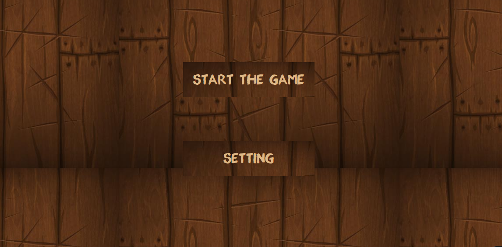
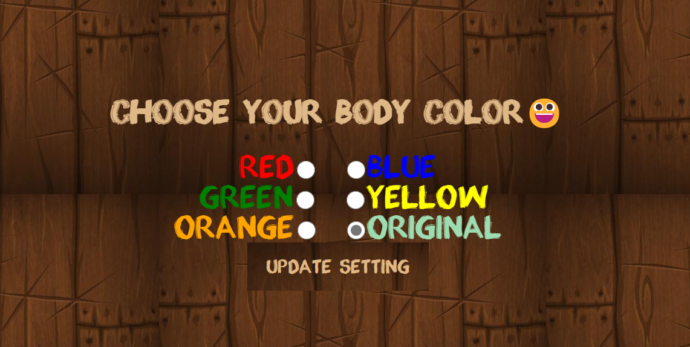
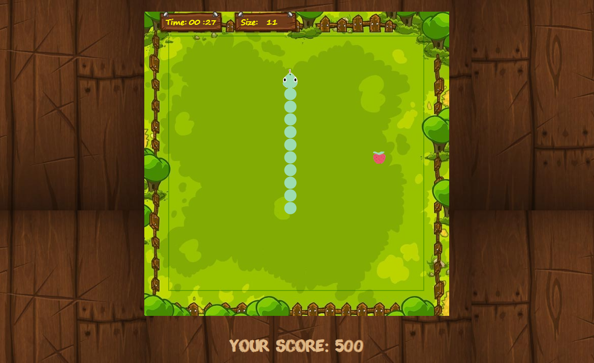
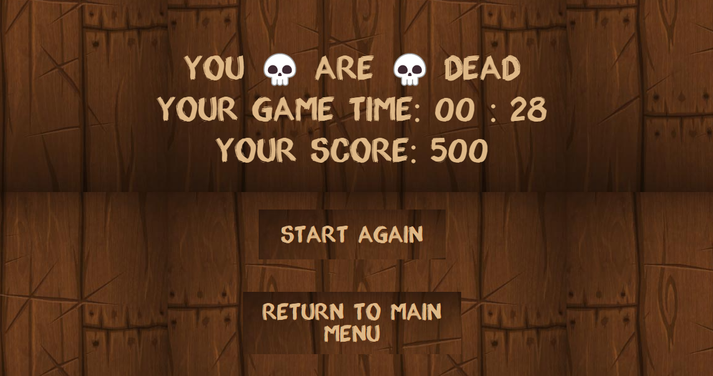

# Snake
## Introduction
A web game with CSS, JS and HTML.  
Player control the snake to eat apples and gain points without making its head collide with any side of the map or its body.  
Sanke will grow longer each time it eat the apple.
## Control
Press `WASD` on keyboard to control the move of snake.
## Example

